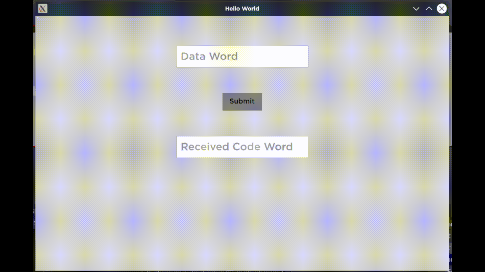

# Hamming Code
Implementing hamming code algorithm using PySide2 and QML

- [Content](#content)
  - [What's Hamming Code](#whats-hamming-code)
  - [Algorithm](#algorithm)
  - [Output](#output)

## Content

### What's Hamming Code
Hamming code is an error correction system that can detect and correct errors when data is stored or transmitted. It requires adding additional parity bits with the data. It is commonly used in error correction code (ECC) RAM.
[Read more...](https://www.techtarget.com/whatis/definition/Hamming-code#:~:text=Hamming%20code%20is%20an%20error,correction%20code%20(ECC)%20RAM.)

### Algorithm
First we need to know number of prity bits (**k**). We use the $n <= 2^k - k - 1$ formula to calculate **k** value.
```python
def calcRedundantBits(self, n):
    for k in range(n):
        if(n <= 2**k - k - 1):
            self.m_k = k
            return
```
Above function calculate minimum value of **k** that applies to above formula.

When we calculate **k** value, we must specify the position of parity bits (Positions from 1 to $n + k$). Parity bits are placed in positions that are power of 2 ( $2^0, 2^1, 2^2, ...$ ).  
For that we declare following function:
```python
def posRedundantBits(self, data):
    n = len(data)              # length of data word (i.e. 1001)
    k = self.m_k               # value of k (in this case is 3)

    m = n + k                  # length of code word (not completed yet)

    j = 0
    l = 0
    res = ''
    for i in range(1, m + 1):
        if(i == 2**j):
            res += 'p'
            j += 1
        else:
            res += data[l]
            l += 1

    self.m_codeWord = res      # pp1p001
```
Now we have the code word with positions specified by **p** for parity bits.

Then we need to calculate each parity bit value using **xor**'ing those bits from code word when the bitwise and (**&** operator) between position of bit (j) and $2^i$ (powers of 2) is equal to $2^i$. Notice that the parity bit itself that we're calculating, must not be used in **xor**ing.  
The following function do above functioality:
```python
def calcParityBits(self):
    # length of code word with specified positions (i.e. pp1p001)
    m = len(self.m_codeWord)
    k = self.m_k

    for i in range(k):
        # initial val for calculating xor (0 is xor identity)
        val = 0
        for j in range(1, m + 1):
            # second condition is for ignoring the parity bit itself
            if((j & (2**i) == (2**i)) and (j != 2**i)):
                val = val ^ int(self.m_codeWord[j - 1])
                
        # remove p from code word
        self.m_codeWord = self.m_codeWord[:(2**i) - 1] + self.m_codeWord[(2**i):]

        # replacing the calculated parity bit in the position of removed p
        self.m_codeWord = self.m_codeWord[:(2**i) - 1] + str(val) + self.m_codeWord[(2**i) - 1:]

        # the code word in end is 0011001
```
Finally **self.m_codeWord** is the code word that we calculated for data word given.

In addition, for error checking in calculated code word we should **xor** same bits as previous section, but in here we must use the parity bit itself too.  
The following function calculate **xor** same as previous function with this difference that we don't need to ignore the parity bit itself.
```python
def detectError(self, data):
    m = len(data)
    k = self.m_k

    res = ''
    for i in range(k):
        val = 0
        for j in range(1, m + 1):
            # in here we don't need to ignore the parity bit itself
            if(j & (2**i) == (2**i)):
                val = val ^ int(data[j - 1])

        res += str(val)

    # parity 1 must be in lowest position so we reverse the res
    res = res[::-1]

    # converting res from binary to decimal to detect error position
    self.m_errPos = int(res, 2)
```
The **self.m_errPos** value is equal to bit position that is broken.

### Output
The following gif shows output of program:

